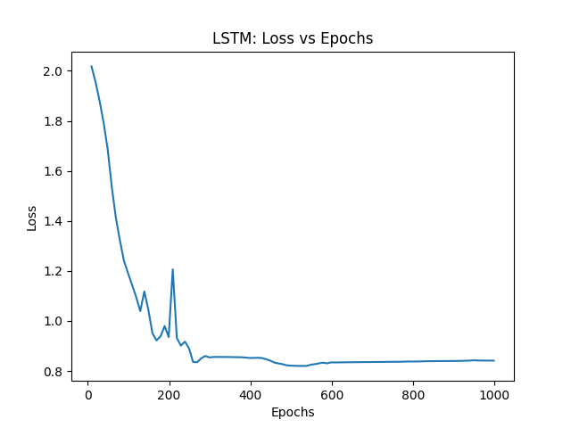

This project is developed based on @ruohoruotsi 's project [`LSTM-Music-Genre-Classification`](https://github.com/ruohoruotsi/LSTM-Music-Genre-Classification).

# Introduction

After I ran the original project, I found that the training process oscillated a lot. So according to the optimized advice, I tried to find a better learning rate for this training.

After trying many times, I found a better learning rate `0.00003`. But the training process still oscillated a lot. So I tried 2 methods to solve this problem:

1. **Using Piecewise Decay method:**

    Set the learning rate to decay to 0.1 at 30% of the training period, and to 0.01 at 60% of the training period. The result is:

    

    

    

    

    

2. **Using Reduce LR On Plat:**

    Once found that the validation loss did not improve over a period of time, reduce the learning rate to 10% of the original. And set a cool period of 10 iterations.

    

    

    

    

    

    

We can see that the training process is much more stable now.

# How to use this project

1. Environment

    Dependencies: `torch`, `librosa`, `numpy`, `matplotlib`

    The environment Backup for Anaconda is [`MusicClassificationEnv.yaml`](./MusicClassificationEnv.yaml)

2. Files

    * [`gtzan`](./gtzan/): GTZAN dataset.

    * [`GenreFeatureData`](./GenreFeatureData.py): Generate the training set, test set and validation set from original gtzan dataset. **If you want to regenerate the training set, please delete `.npy` files in `./gtzan` first!**

    * [`lstm_genre_classifier_pytorch_PiecewiseDecay.py`](./lstm_genre_classifier_pytorch_PiecewiseDecay.py): Training with Piecewise Decay method.

    * [`lstm_genre_classifier_pytorch_ReduceLROnPlateau.py`](./lstm_genre_classifier_pytorch_ReduceLROnPlateau.py): Training with Reduce LR On Plateau method.

    * [`generate_music_plots.py`](./generate_music_plots.py): A small script to generate plots of MFCC (Mel Frequency Cepstrum Coefficient), Spectral Center, Chromaticity feature and Spectral Contrast.

    * [`weights`](./weights/): Trained model weights and model architecture.

    * [`result`](./result/): Save the plots of training process and confusion matrix.

# Discussion and Conclusion

With Reduce LR On Plateau, the accuracy of the classification of audio increased to 79.05%. But the accuracy of hiphop is really low, at just 0.35. And 0.55 of hiphop validation set are classified as metal. This might be a big problem to solve in order to increase accuracy.

There are a few suggestions that may help optimize it:

* Change dataset.
* Use Current Batch Normalization after get features by librosa.
* Use Attention or other models.
